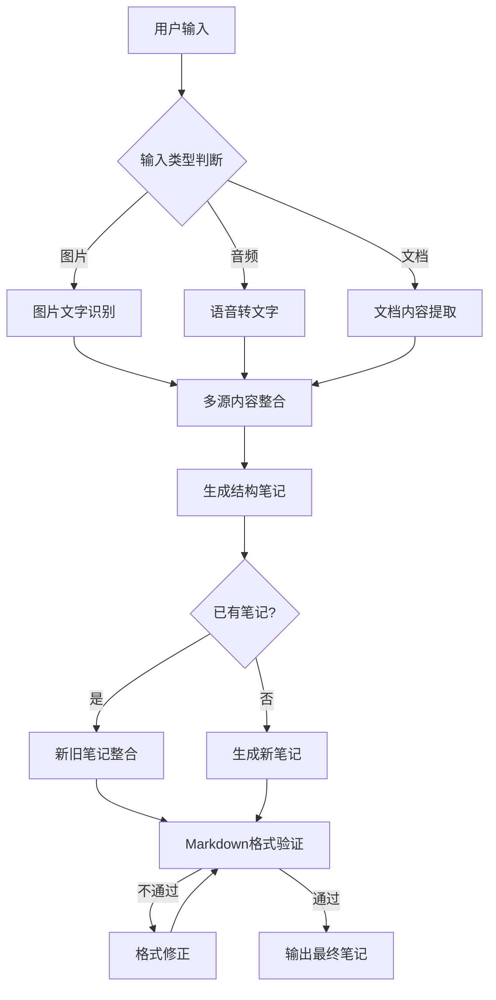

# 📚 板书知识整理助手 - Test
本项目是一个基于人工智能的板书知识整理工具，能够自动识别和处理各种格式的教学内容，生成结构清晰、格式规范的Markdown笔记。

 [网页访问点这里](https://udify.app/workflow/bC0JxE2hEysJrW8w)
## 🌟 核心功能
### 多模态输入处理
- **图像识别**：支持JPG, JPEG, PNG, GIF, WEBP, SVG格式的板书图片
- **文档提取**：支持各类文档格式的知识点抽取
- **语音识别**：可将授课录音自动转为文字
- **文本输入**：直接整理文字内容
### 智能处理流程

### 高级笔记整理能力
- 内容整合：自动合并相似内容，保留不同知识点
- 结构化排版：多级标题、列表、表格自动生成
- 重点标注：关键术语自动加粗，重要提示使用引用格式
- 数学公式特殊处理：避免符号与汉字粘连问题
### Markdown严格验证
- 格式完整性检查（代码块、链接、标题等）
- 嵌套列表缩进合理性验证
- 段落分隔正确性检查
- 自动修复不符合规范的格式问题
## 🚀 如何使用
### 输入参数
| 参数名 | 类型 | 描述 | 必填 |
|--------|------|------|------|
| `笔记生成要求` | 段落 | 用户的具体整理需求 | 否 |
| `图片集` | 文件列表 | 拍摄的板书照片 (最多10张) | 否 |
| `音频` | 文件列表 | 上课录音 (最多10个) | 否 |
| `文档` | 文件列表 | 教材/讲义文档 (最多10个) | 否 |
| `需要整合的笔记` | 单个文件 | 已有的Markdown笔记文件 | 否 |
### 输出示例
```markdown
# 量子力学基础
## 1. 基本概念
- **波粒二象性**：微观粒子同时具有粒子性和波动性
- **不確定性原理**：Δx·Δp ≥ ħ/2
> 海森堡1927年提出，是量子力学基本特性
### 1.1 薛定谔方程
$$ i\hbar\frac{∂}{∂t}\Psi(\mathbf{r},t) = \hat{H}\Psi(\mathbf{r},t) $$
## 2. 实验对比
| 实验名称 | 现象 | 经典解释 | 量子解释 |
|----------|------|----------|----------|
| 双缝实验 | 干涉条纹 | 波的现象 | 粒子波动性表现 |
```
#### 转接到Markdown在线编辑器（如stackedit）即可美观地显示渲染结果
## 🧠 核心技术
### 模型配置
- **主处理模型**: DeepSeek-V3
- **图像识别**: Qwen/Qwen2.5-VL-72B-Instruct
- **语音转换**: FunAudioLLM/SenseVoiceSmall
### 处理流程
1. 内容抽取：从原始素材中提取有效信息
2. 多源聚合：不同来源的内容智能整合
3. 格式生成：严格按照Markdown规范组织内容
4. 循环验证：多层校验确保格式正确性
5. 智能修复：自动纠正格式问题（最多3次尝试）
## 🔧 部署与运行
```bash
# 环境要求
Python >= 3.8
pip install -r requirements.txt
# 运行应用
python main.py
```
## 📄 支持文档
- [输入输出规范](docs/IO_SPECS.md)
- [API接口文档](docs/API.md)
## 📬 问题反馈
遇到任何问题或功能需求，请在Issues中提交：[问题反馈](https://github.com/MingASA/blackboard-note-maker/issues)
---
**让知识整理变得更简单高效！** 🎓 使用板书知识整理助手，告别无序笔记，拥抱结构化知识！
